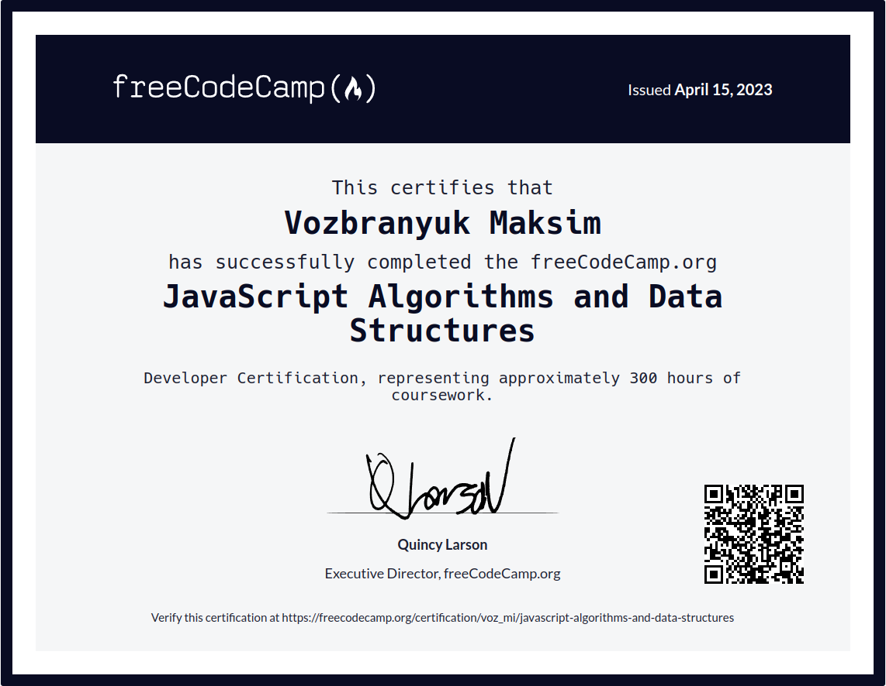

# JavaScript Algorithms and Data Structures

    

## Projects
- ✅ [Palindrome Checker](palindrome-checker)
- ✅ [Roman Numeral Converter](roman-numeral-converter)
- ✅ [Caesars Cipher](caesar-cipher)
- ✅ [Telephone Number Validator](phone-number-validator)
- ✅ [Cash Register](cash-register)

    

## About implementation
These projects are written in `TypeScript` with `Jest` tests. Code style is checked with `ESLint` and `Babel` configured to build JS.
